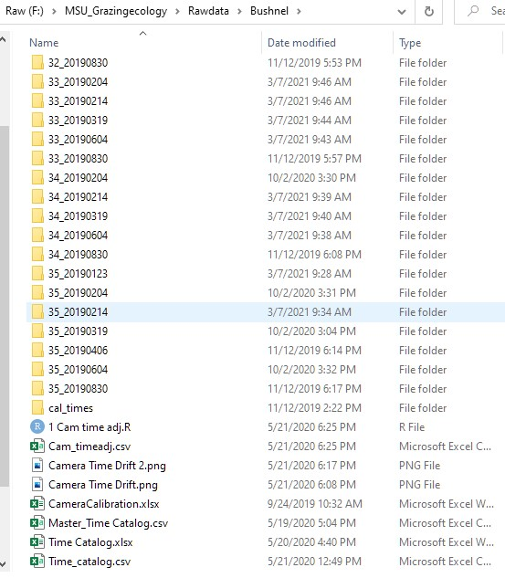
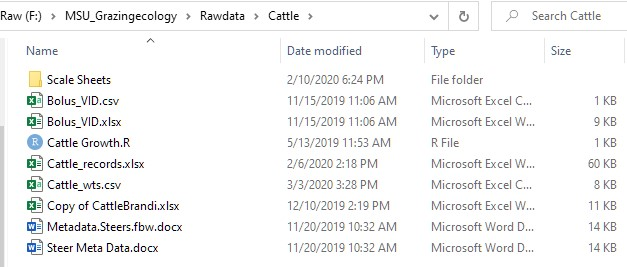
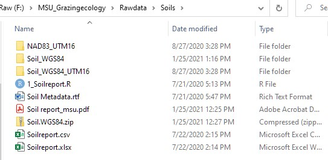
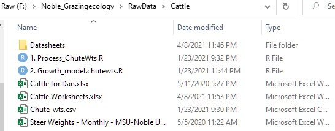

--- 
title: Thinking Like a Mountain Metadata
author: "Ira L. Parsons"
# date: "`r Sys.Date()`"
# description: ''
documentclass: book
bookdown::gitbook: default
# github-repo: niklaslollo/quals
bibliography: [references.bib]
biblio-style: apalike
link-citations: true
colorlinks: true
knit: "bookdown::render_book"
site: bookdown::bookdown_site
# subtitle: Timeline and comments regarding the field research and data analysis conducted to date on the Thinking Like a Mountain Project
# cover-image: Pictures/Title_page.jpeg # Only used for epubs
---
# Preface {-}  
  
This short book introduces the Thinking Like a Mountain Project and should aid in the workflow for any researchers who follow. This project was extremely fun, very challenging, and presented the mechanisms for me to learn a great deal about fields here-to-fore unfamiliar to me. It delves into topics of Animal Science, Rangeland Ecology, Movement Ecology, Metabolic Theory, Remote Sensing, and Data Science. It is my sincere hope that anyone using this data will approach this project as an opportunity to gain a deeper appreciation and respect for the culture of the unique people who have built their lives around caring for these natural resources while providing food to feed the rest of us.  

Ira  

![(#fig:rname) Crossbred beef steers were fitted with tracking collars equipped with GPS location, Accelerometers, and at the Noble Research Insitute, front facing cameras. This created an unprecedented volume of data, requiring hundreds of pages of rscript to analyze. Here, I describe my naming system to keep track of Analysis's, Seris number to describe version, and the run order in a multiseries script interface. Output was named using the 3 numbers used to uniquely identify each Rscript. As always, future researchers should look at R script to see which data version the Rscript uses, and what the output is to find specific analysis pathways.](Pictures/R Naming nomenclature.jpg)

<!--chapter:end:index.Rmd-->

# Thinking Like a Mountain  

This book details the timeline and events occurring during the execution of research and data analysis conducted under the purvue of the *Thinking Like a Mountain to Improve Animal Production Systems: Ecology, Energy Budgets, and Mechanistic Models*, USDA NIFA grant no. 2018-67016-27481/ project accession no. 1014926. This project was conducted in collaboration with Mississippi State University, College of Forest Resources - Department of Wildlife Fisheries and Aquaculture, College of Agricultural Life Sciences - Department Animal and Dairy Science, and The Noble Research Institute. This project would have been impossible without a collaborative and diverse team of scientists who planned the project, and the dedicated team of graduate researchers, facility personnel, and undergraduate technicians who aided in the data acquisition and analysis. To enable future researchers to pick up the baton and quickly move forward with analysis, this document will describe the grazing landscapes, animals, and equipment used during the research project. It will also describe the data organizational structure, location of raw data, success of data acquisition including any gaps and reasons for data missingness, and provide a general timeline for each field season. Further, there will be a description of data format and code used for data analysis, the location of the materials, and what presentations and research manuscripts were derived from the data. Finally, a complete list of principle investigators, graduate student research assistants, facility personnel, and undergraduate research technicians will be provided along with their respective roles and contributions.  
 
The fundamental vision for the project is casts in the original narrative, which is available on the [USDA NIFA website](https://portal.nifa.usda.gov/web/crisprojectpages/1014926-thinking-like-a-mountain-to-improve-animal-production-systems-ecology-energy-budgets-and-mechanistic-models.html) and in the [Thinking Like a Mountain folder](F:\Thinking Like a Mountain) in the Raw data drive. As described in the project narrative, the first year of data was collected starting in January, 209, on the H.H. Leveck Animal Research Center, also the South Farm, at Mississippi State University in Starkville, MS. The second year of data collection occurred starting Janury, 2020 on the Pasture Development Facility at the the Noble Research Institute in Ardmore, Oklahoma.  

```{r ,fig.id='proj_tl', echo=FALSE, message=FALSE, warning=FALSE, out.extra='angle=90', fig.cap='Below we see an overall outline of data collection at both research sites, as well as the overall timeline for both research technitions start and stop dates. Also included are dates of manuscript publications, national meeting presentations, and other important dates of note.'}
library(readxl)
library(lubridate)
library(tidyverse)

trial.tl = readxl::read_excel(path = 'Trial_timeline.xlsx', sheet = 'Timeline') %>% 
  mutate(Date = ymd(Date),
         YDay = yday(Date)) 
  # filter(Event != 'Body weights' & Event != 'NDVI')
pos = data.frame(Group = unique(trial.tl$Group), pos = c(-2, -2, 2, 2))
trial.tl = trial.tl %>% left_join(pos) 

trial.tl %>% 
  ggplot(aes(x = Date, y = 0, label = Event, color = Group))+
  geom_segment(data = trial.tl, aes(x=Date, y=0, yend = pos, xend=Date), color = 'black', size = 0.2)+
  geom_point(size = 3)+
  geom_text(aes(x=Date, y=pos, label=Event, color=Group), angle = 30)+
  scale_x_date(date_breaks = '1 month', minor_breaks = '2 week')+
  scale_y_continuous(limits = c(-3, 3))+
  geom_hline(yintercept = 0, color = 'black', size = 0.1)+
  labs(col = 'Data stream')+
  theme_classic()+
  theme(axis.text.x = element_text(angle = 90),
        axis.text.y = element_blank(),
        legend.position = 'bottom')
```

<!--chapter:end:01-intro.Rmd-->

# MSU Grazing Ecology  
All data for the field season conducted at Mississippi State University is saved in the Fantom Drive labeled 'Raw' within the folder MSU_Grazingecology and the sub-folder 'Rawdata'. Each data stream is saved into a sub-folder named after the brand-name of the device used to collect the data, i.e. the GPS location data is saved in a folder labeled 'Lotek' named after the Lotek GPS tracking collars used for this field effort. The first study was conducted at the [H.H. Leveck Animal Research Center](https://www.ads.msstate.edu/facilities.php) on the Mississippi State University, also known as the [South Farm](https://map.msstate.edu/?id=233#!m/70170?s/). Follow the links to see the specific location on the South Farm, while the specific layout of the pasture for the trial period is described in Figure (\@ref(fig:msupas)).  

```{r ,fig.id='msupas', echo=FALSE, message=FALSE, warning=FALSE, fig.cap='Layout of the Grazing Ecology Pasture on the South Farm for the trial conducted January 23^rd^, 2019 through December 15^th^, 2019.'}
##### Grazing Ecology Pasture in Starkville #####
MSU.pas = rgdal::readOGR("../MSU_Grazingecology/RawData/MSU_Pasture/WGS84_UTM16/MSU_Pasture.shp") # read WGS84 pasture
# plot(MSU.pas)
## Pasture Map
MSU.pas.buf = rgeos::gBuffer(MSU.pas, width = 40)
# plot(MSU.pas.buf)

## Import June 20 NDVI layer. Collected with MicaSense Camera
# Initial 8.5 cm resolution
ras = raster::stack('../MSU_Grazingecology/RawData/Mica_Sense/BGRNE_NEV/BGRNE.NEV_2019_01_15.tif')[[1:3]]
## finescale raster map
ras.buf = raster::mask(ras, MSU.pas.buf)
raster::plotRGB(ras.buf, r=3,g=2,b=1, stretch = 'lin');sp::plot(MSU.pas, lwd=3, add = TRUE)
```

The project was conducted during the calendar year 2019. We see in the timeline \@ref(fig:msu_tl), the general frequency of events, including the aquiring cattle on December 18^th^, 2018, initiation of sampling in early January, all prior to fitting collars on cattle and releasing them into the pasture on January 23^rd^, 2019. The trial concluded on December 15th, 2019, however, most data devices had failed by this point, specifically the Herdstrong rumen boluses and Lotek GPS tracking collars. A more detailed description of each data stream is listed in the subsections listed below.  

```{r ,fig.id='msu_tl', out.extra='angle=90', echo=FALSE, message=FALSE, warning=FALSE, fig.cap='The timeline laid out below shows the general sequence of events, both planned and unplanned, for the timeline of the field season on the South Farm.'}
library(readxl)
library(lubridate)
library(tidyverse)

msu.tl = readxl::read_excel(path = '../MSU_Grazingecology/RawData/MetaData/TotalData.xlsx',
                            sheet = 'Timeline') %>% 
  mutate(Date = ymd(Date),
         YDay = yday(Date)) 
  # filter(Event != 'Body weights' & Event != 'NDVI')
pos = data.frame(Group = unique(msu.tl$Group), pos = c(1, -6, -1, -2, -5, 3, -3, 4, 6.5))
msu.tl = msu.tl %>% left_join(pos) 

msu.tl %>% 
  ggplot(aes(x = Date, y = 0, label = Event, color = Group))+
  # geom_segment(data = msu.tl, aes(x=Date,y=0, yend = pos, xend=Date), color = 'black', size = 0.2)+
  geom_point(size = 3)+
  geom_text(aes(x=Date, y=pos, label=Event, color=Group), angle = 45)+
  scale_x_date(date_breaks = '2 week', minor_breaks = '1 week')+
  scale_y_continuous(limits = c(-8, 8))+
  geom_hline(yintercept = 0, color = 'black', size = 0.1)+
  labs(col = 'Data stream')+
  theme_light()+
  theme(axis.text.x = element_text(angle = 90),
        axis.text.y = element_blank())
```

## Bushnel {#bushnell}   
Thirty-five [Bushnel Essential](https://www.bushnell.com/trail-cameras/standard-trail-cameras/trophy-cam-e3-essential-trail-camera/PB-119837C.html) game cameras were mounted at regular intervals around the perimeter of the pasture. Cameras were checked regularly to ensure they were functioning correctly, and a video was recorded to sync the camera time with UTC time using the [time.is/GMT](https://time.is/GMT) website. The technician first opened the camera door, shut the camera off, and turned it back on, which initiated the camera's startup sequence. After start up, the technician then snapped their fingers on camera at a recorded UTC time, which are saved "Time Catalog.xlsx" which includes both the recorded time and date, along with the observed time and date. These are combined into the "Master_Time Catalog.csv" using the R code in "1 Cam time adj.R" script. Videos containing observed calibration sequences are saved in the "cal_times" folder. This was used to create a "Cam_timeadj.csv" file, which identifies the correct adjustment for each camera over the duration of the trial (Figure \@ref(fig:drift)). It is noted that as time progressed, camera drift increased (Figure \@ref(fig:drift)). Pictures were downloaded from the cameras at frequent intervals, as demonstrated in Figure \@ref(fig:prof_tl), and placed into an individually labeled folder within '*F:\MSU_Grazingecology\Rawdata\Bushnel*' location on the raw data drive. Folders were named according to camera number and download date, separated by an underscore and dated according to the yyyymmdd fashion. So, folder 1_20190204 are pictures from camera 1 and downloaded on 2019-02-04, or February 4^th^, 2019.

  

  
**Bushnell camera files** Figure \@ref(fig:bushfiles)
* Camera files - Folders containing game camera pictures from each download. Labeled Cameranumber_YYYYMMDD
* cal_times - Bushnell videos containg calibration snaps by Kyle Ferguson
* Cam_timeadj.csv - The time difference between timestamps and UTC time
* Camera Time Drift.png - Plot of time drift over the course of the study (Figure \@ref(fig:drift))
* Master_Time Catalog.csv - The UTC timestamp of calibration sequences performed in the field
* Time Catalog.xlsx - Excel workbook of calibration sequences for each camera and the UTC timestamp

## Cattle  
Steers were sourced from the [Brown Loam](https://www.mafes.msstate.edu/branches/central.asp?location=brownloam) research station on December 18^th^, 2019. Herd records indicating birthdate, sire number and breed, cow number and breed, and birth weight, are available in the excel sheet 'Copy of CattleBrandi.xlsx', (Figure \@ref(fig:msucatfile)). Original scale sheets and notes from cattle processing are saved into the "Scale Sheets" folder, which are the raw scale sheets used to record data chuteside. Data was recorded into the spreadsheet "Cattle_records.xlsx", with a separate sheet used for each weighing event, and then combined into the "DATA" sheet, which was read into the R space and saved to the "Cattle-wts.csv" file. All weights are recorded in pounds unless otherwise specified. Specific notes for each animal, regarding numbers, new tags, bolus assignments, individual animal management, are recorded in the raw data, individual date sheets, and the "Cattle" sheet. Cattle growth weights were tracked live in the "graphs" tab.  
In publication, cattle should be described as British crossbred steers. 

  


## Daily Diary Accelerometers  
Daily diaries (Figure \@ref(fig:ddmt)) were deployed in the housing of the lotek collars above the battery pack in a holder cut from Kaizien foam. Data from each deployment is recorded in an individual metadata file for that animalxtime combo. Folders are labeled with the deployment date and animal number, i.e. 20190123_F029 was deployed on January 23^rd^, 2019 on animal F029. Deployment data are also saved in the master metadata file located  The "text.txt: and 'text2.txt' files are saved Metadata folder *F:\MSU_Grazingecology\Rawdata\DDMT\Metadata* in the file "MSU_Collar_DDMT_Logs.xlsx" file. This folder includes the animal VID (**visual identification number**), color color, Accelerometer ID number, SD card ID number, Deployment name, Turnon date, Turnon time, Deployment date, Calibration date and time, retreival date in both current time and UTC time, final calibration sequence, turnoff time. Also included are data processing information from the DDMT software (*F:\Software\DDMT*), such as Data end date and time for each text file, Geomag adjustments for each file, and the export location for splits. Here, any noted issues with the data are made in the Comments column. 

- Calibration steps are reported in the sheet labeled 'Calibration_steps' in the data log excel file.
- Sheet1 includes basic information noting collar number, accelerometer number, and animal id which may be usefull to link data to individual animals.

  

### DDMT instructions    

Using Accelerometers with DDMT  

1.	Format SD Card 
  + Format SD card by right clicking on the SD card and selecting format using FAT32 format – this takes a while.
2.	Open DDMT and select command line generator 
  + Generate a command line with options selected to not overwrite data
3.	Create a text file, labeled “text.txt” on the SD card, paste the command line into the first line of the file in TextEdit
4.	Click on a button to allocate text files of 2 gb each on SD card
  + Extract SD card, it is now formatted and ready for deployment
5.	Select an accelerometer, in a sheet, record what SD card is deployed with what accelerometer.
6.	Insert the SD card into the SD card slot on the accelerometer until a firm click is heard. Apply a small spot of hot glue to the back of the sd card to prevent falling out. 
7.	Plugin the battery, recording the exact time, UTC time, the battery is plugged in. Look for two bright yellow flashes and then observe closely for a light green flash, indicating the accelerometer is recording data.
8.	Insert the accelerometer and the battery into the foam, place the foam into collar housing, and ensure it is waterproofed. 
9.	In an open area, calibrate the collar, recording the exact second, UTC time, calibration begins.
  + Holding the collar upright, oriented like it will be on the animal, push the collar directly out from your chest, then bring it abruptly back. Do this 5 times.
  + Holding collar upright, push out from chest and hold to count of 10.
  + Holding the collar upright, in front of your chest, move the collar side to side, first left, then right, five times.
  + Holding the collar upright in front of your chest, move the collar swiftly up and down, down, then up, five times.
  + Facing directly towards magnetic north, Rotate the collar end over end, pushing the top away from you, and begin to slowly spin in a circle, stopping in the original northerly direction. 
  + Facing the northerly direction with the collar directly in front of your chest, rotate the collar around the Z axis which extends from the bottom of the collar to the top of the collar towards the sky. Continue rotating while slowly spinning around all points of the compass
  + Repeat points iv. and v. 
  + Record conclusion of calibration
10.	Deploy collar onto animal. 
11.	Recollect collar from animal
  + Record date and time. (might not hurt to do a second calibration, opportunity to log any time drift relative to the accelerometer time.)
12.	Extract the SD card; save text files to database
13.	Open DDMT > select File to be analyzed > set working directory > Load first split
14.	Display 
  + Select interested values
  + Graph Acceleration
  + Graph Geomagnatism
  + Graph VeDBA
  + Display overlay window
15. 3D controls 
  + Rot’ correction
  + Apply rotation to whole dataset
16. Time/Date offsets
  + Enter Start date in Day, Month, Year format
  + Set time, using pre-recorded time for starting the accelerometer
17. Accel/mag detail/offsets
  + Find calibration in accelerometer dataset
  + Magnetometer offsets
  + Show 3D
  + Click 3rd from left box to activate geomag calibration
  + Click left alt right mouse click 2X to 
18. Input/output
  + Filename – Deployment date_VID
  + Change suffix number to 1 for text 1, 500 for text 2
  
Cleaned data excludes the data from when the device was not deployed on the animal.


## Forage and Pasture  
### Forage  
Forage samples were collected on a 20 meter grid on each forage sample locations (Figure \@ref(fig:msusampleloc)), which are detailed in the folder *F:\MSU_Grazingecology\Rawdata\MSU_Pasture\Samplingpoints*. In total 307 forage sample locations were identified for sampling. Metadata for the forage data is located in the *F:\MSU_Grazingecology\Rawdata\Forage\Supporting docs* folder. Labels for the bags were created using the "Forage Sample Labels.xlsx" workbook, which was sent to the Forage Lab at the Noble Research Institute. 307 locations were collected for Near Infrared Spectroscopy (NIR) analysis. 50 sample locations were identified, an a separate sample was collected identical to the first sample, and sent to the lab for Wet Chemistry Analysis. The matching locations are detailed in the excel workbook "Forage_locMatched.xlsx". Metadata for the NIR and Wet Chemistry results are located in the "NIRColumn Headings.xlsx" workbook, which describes the metric for each variable returned by the analysis.

```{r ,fig.id="msusampleloc", echo=FALSE, message=FALSE, warning=FALSE, fig.cap='Forage sampling locations for the MSU grazing ecology pasture.'}
##### Grazing Ecology Pasture in Starkville #####
MSU.pas = rgdal::readOGR("../MSU_Grazingecology/RawData/MSU_Pasture/WGS84_UTM16/MSU_Pasture.shp") # read WGS84 pasture
# plot(MSU.pas)
## Pasture Map
MSU.pas.buf = rgeos::gBuffer(MSU.pas, width = 40)
# plot(MSU.pas.buf)

## Import June 20 NDVI layer. Collected with MicaSense Camera
# Initial 8.5 cm resolution
NDVI = raster::stack('../MSU_Grazingecology/RawData/Mica_Sense/BGRNE_NEV/BGRNE.NEV_2019_01_15.tif')[[6]]
## Import sampling locations
sample.loc = rgdal::readOGR(dsn = '../MSU_Grazingecology/RawData/MSU_Pasture/Samplingpoints/NIRSshape/NIRSpoints.shp')
sample.loc = sp::spTransform(sample.loc, CRSobj = ("+proj=utm +zone=16 +datumWGS84"))
# plot(sample.loc);plot(MSU.pas, add = TRUE)

## finescale raster map
NDVI.buf = raster::mask(NDVI, MSU.pas.buf)
sp::plot(NDVI.buf,
     main = 'MSU grazing pasture',
     xlab = 'Longitude',
     ylab = 'Latitude',
     legend.args = list(text = 'NDVI'));sp::plot(sample.loc, add = TRUE);sp::plot(MSU.pas, add = TRUE)

```
Navigation to sample locations was accomplished using a Garmin handheld device (Figure \@ref(fig:garmin)). This allowed us to navigate to each sample location (Figure \@ref(fig:msusampleloc)), where we then through the 1/4m^2^ quadrate in a random direction over our shoulder, and cut the sample using hand shears (Figure \@ref(fig:clipper)). Following clipping of forage sample, it was placed in a brown bag (Figure \@ref(fig:samplebag)), sealed, and prepared for shipment to the forage lab at the Noble Research Institute.

  

  

   

Notes are reported in the Garminwaypoints folder. Pasture statistics were calculated using the Rcode, *MSUpasture.R*. Results from the NIR data are located in the folder *F:\MSU_Grazingecology\Rawdata\Forage\NIR_results*, and the Wet Chemistry results are in *F:\MSU_Grazingecology\Rawdata\Forage\Wet_results*. The Rcode files, ran in order from 1 - 3, create the NIRStacked.csv, WETstacked.csv, and the combined Forage.csv files. The folder *F:\MSU_Grazingecology\Rawdata\Forage\forage.spat*, contains a spatial dataframe containing the forage data.

  
**Forage files list** Figure \@ref(fig:foragefiles)
* forage.spat - forage data saved to spatial data frame
* NIR_results - Raw data files for Near Infrared Spectroscopy (NIR) data, Labeled according to Location (MS) date (YYYYMMDD) and method (NIR)
* Pre_RDMS - Raw data download from the Noble Server
* Supporting docs - Folder containing sample labels, sample points, location match data table, and shipping record sheet
* WET_results - Raw data files for wet chemistry forage samples Labeled according to Location (MS) date (YYYYMMDD) and method (NIR)
* Forage.csv - Final data table for all forage samples
* NIRStacked.csv - All data from NIR sample results
* WETstacked.csv - All data from WET chemistry results


### Pasture

  
**MSU Pasture file list** Figure \@ref(fig:pasturefiles)
* DEM_lider - The folder containing the Digital elevation maps. See folder metadata for specifics
* NAD_UTM16 - The folder with pasture shape files using the NAD83 GIS system projected in UTM16 projection system
* Samplingpoings - Folder containing original pasture and sampling point shapefile data
* WGS84 - Folder with the pasture and sampling point shapefiles in WGS84 system
* WGS84_UTM16 -  Folder with the pasture and sampling point shapefiles in WGS84 system projected using UTM 16
* MSUPasture.r - Rscript used to process MSU pasture shapefile data  

## Herdstrong  
[Herdstrong](https://herdstrong.com/) data experienced many faults and issues. The dates and records for the application of the boluses to the steers is recorded in the cattle records folder. 


The raw data is in the Herdstrong folder, and is labeled "data.csv". This file contains all of the data for ever collected in the system under Mississippi State’s username. The final data file has been sorted out to only contain relevant bolus data while those boluses were inserted into the animals.  It was sorted according to the code in the "Herdstrong.R" script. 

  

**List of files** (Figure \@ref(herdfiles))  
* Herdstrong bolus test - Testing faulty boluses to determine reason for failure at the [Beardon Dairy](https://www.mafes.msstate.edu/branches/mainstation.asp?location=bearden)
* Bolus MetaData.rtf - Metadata for bolus data
* BolusData.csv - Final herdstrong dataset
* data.csv - Another final herdstrong dataset
* data_92419.csv - Data download on September 24^th^, 2019
* Herdstrong.R - Herdstrong processing script
* herdstrong11-5data.csv -
* herdstrongdata_92419.csv - Herdstrong data from September 24^th^, 2019  

## Jenquip  
We began measuring forage height using the Jenquip forage height meter, but didn't get it collected on a continuous basis for this field season. 


## Lotek  
GPS tracking collars from [Lotek Wireless](https://www.lotek.com/) were utilized to track the animals geolocation data. Manuals and equipment information are available in the resources folder (Figure \@ref(fig:lotekfiles)), which describe both the available technology and how to use it. The collar settings folder contains the script used to set the settings on the collars prior to deployment, collar_info_files contain collar settings and information (Figure \@ref(fig:lotek_files)). The Collars were tested prior to deployment and the data analyzed to ensure they were functioning correctly as expected and those data are available in the Collar_test folder (Figure \@ref(fig:lotek_files)). Raw GPS location data downloaded both via the pinpoint data logger, and connection to collars at the conclusion of the study, are in the GPS_data folder.


  

2019-01-31 – Calf F086 still in pen, communicated with LoTec concerning collar malfunction, collar did powered on and emitted VHF signal on the correct frequency, however, never communicated with PPC and failed to collect GPS points at any point. Product Firmware out of date, Ben proposed updating firmware. Updated PPH and then all communication with collar was lost, emitting a strange sequence of NA in the product parameter settings. In communication to begin warranty work. 
The Daily Diary accelerometer was and is, still collecting data nicely.

  

## Micasense UAS flights  
Remotely sensed imagery was collected using a Red Edge MX hyperspectral camera (MicaSense®, Seattle, WA, USA) mounted on a Matrice 100 unmanned aerial system (DJI, Shenzhen, Guangdong, China). The camera collected reflectance in the green, blue, red, near-infrared, and red-edge spectral bands at 8.5 cm resolution from a flight altitude of 122 m above ground level with 80% overlap.  


After imagery was collected, individual pictures were mosaiced utilizing Pix 4D software (Pix 4D Inc. Prilly, Switzerland) and we calculated the normalized difference vegetation index (NDVI) at each pixel following standard procedure [@huete_overview_2002]). Complete description can be found in the description given by [@parsons_aiming_2022].  

  

**MicaSense files** Figure \@ref(fig:micafiles)
* BGRNE_NEV - The folder containing stitched micasense files. Image files were stacked in order Blue, Green, Red, Near Infrared, and Red Edge i.e.BGRNE, followed by the calculated files NDVI, EVI, and VARI i.e. NEV.
* Extracted_data - Folder containing data files containing data extracted from the underlying raster layers at each forage sampling location
* Moving_Window - Calculated rasters aggregated using moving window technique using the Rscript in the MetaData folder, and as described below
* Raw - Folder containing the individual pictures and supporting data collected by the MicaSense camera during the flight
* Res_change - Folder containing files calculated using the [Change raster resolution section]{#hange} below

Below is a reproduction of the METADATA created describing specific files, code, and equations used to calculate additional layers

**Files Needed**
- Forage.csv
- Extracted.csv

**File Produced**
- Forage.datafinal.csv

**Derivation of "Forage.csv"#### ->uses "Forage_Sampling.R"**

- First we import the excel spreadsheets produced by the lab. #MUST MAKE SURE THE FORMATS MATCH OTHERWISE CODE WILL NOT RUN PROPERLY!!!
 
- Two Sets of spreadsheets nir.files and wet.files and the names of the tables produced in R are "NIR" and "WET"

- nir.files comes from the "Rawdata/Forage/NIR_results" directory within the MSU_Grazingecology folder
- wet.files comes from the "Rawdata/Forage/Wet_results" directory within the MSU_Grazingecology folder

- Once all excel files are read into R, and put into one table, we cut out columns from lab we don't need

- column names taken out in "NIR":"ProjectName","ForageSampleID","ExperimentName","ExperimentID","ForageSampleDescription", "DateSampleReceived","NFLabID","Status","SampleDescription","BudgetCode","Crop","X_loc", "Y_loc","Species_type","EntityID","Date_Received" 

- remaining columns are renamed:"NIR.DateCollected","NIR.Wetwt.g","NIR.Drywt.g","NIR.CP.PDB","NIR.DM.PAR",
                 "NIR.Ca.PDB","NIR.P.PDB","NIR.K.PDB","NIR.Mg.PDB","NIR.ADF.PDB","NIR.NDF.PDB",
                 "NIR.RFV","NIR.TDN.PDB","NIR.Lignin.PDB","NIR.IVTDMD","NIR.Fat.PDB","NIR.Ash.PDB",
                 "NIR.dNDF48.PDB","NIR.Starch.PDB","NIR.Fructan.PDB","NIR.WSC.PDB","NIR.CP.PAR",
                 "SampleID"
	
- This process is duplicated for "WET"

- column names removed from "WET": "ProjectName","ExperimentName","ForageSampleID","ExperimentID","NFLabID","Status",
                   "BudgetCode","Crop","X_loc","Y_loc","Species_type","EntityID","ForageSampleDescription",
                   "DateSampleReceived","Date_Received"

- remaining columns are renamed: "WetID","Wet.DateCollected","Wet.Wetwt.g","Wet.Drywt.g","Wet.CP.PAR","Wet.CP.PDP",
                 "Wet.DM.PAR","Wet.ADF.PDB","Wet.NDF.PDB","Wet.RFV","Wet.TDN.PDB"

- The "WET" is then joined with a dataframe of sample locations where both wet and NIR samples are taken

- NOTE: wet id 1-6 and 6-1 exist but are not included also corresponding nir 2-13 and 14-1 exist but are not included
- when the lab read these results in, the wet id 6-1 was also paired to the wet 1-6 id and it threw off the corresponding nir samples

- "NIR" and "WET" are then joined together to produce one table titled "Forage"

- "Forage" is then joined with the lat and long coordinates in "Samplingpoints.csv" found in the "Project_planning/Samplingpoints/" directory
- "Forage" is then saved as "Forage.csv" in the "Rawdata/Forage/Derived/" directory


### Data calculations  
**Derivation of "Extracted.csv"#### -> uses both "Forage_Sampling.R" and "Forage_MicaSense.R"**
- Flight data from all periods are brought in unstacked and restacked in R in the order Blue, Green, Red, NIR, Red Edge, NDVI, EVI, VARI
- Also, the 3 derived bands are calculated and stacked 
- Rasters to be stacked are located in the "F:/MSU_Grazingecology/Rawdata/Mica_Sense_processed/Rasters.unstack" directory
- They are read into R and stacked then exported as "BGRNE.NEV_(sample date).tif" to the "F:/MSU_Grazingecology/Deriveddata/Forage.index/BGRNE_NEV" directory

- NDVI calculation:r1$NDVI<-overlay(r1[[3]] (RED band), r1[[4]] (NIR band), fun = function(x, y) {(y-x) / (y+x) }) 
CITATION: Rouse, J. W., Hass, R. H., Schell, J. A., & Deering, D. W. (1973). Monitoring vegetation systems in the great plains with ERTS. Third Earth Resources Technology Satellite (ERTS) Symposium, 1, 309–317. https://doi.org/citeulike-article-id:12009708

- EVI calculation:r1$EVI<-overlay(r1[[1]] (Blue band), r1[[3]] (Red band) ,r1[[4]] (NIR band) , fun = function(b,r,n) {2.5*((n-r)/(n+(6.0*r-7.5*b)+1))}) 
CITATION: Huete, A. R., Didan, K., Miura, T., Rodriguez, E. P., Gao, X., Ferreira, L. G. (2002). Overview of the radiometric and biophysical performance of the MODIS vegetation indices of the radiometric and biophysical performance of the MODIS vegetation indices. Remote Sensing of Environment, 83(1–2), 195–213. Retrieved from https://doi.org/10.1016/S0034-4257(02)00096-2 

Matsushita, B., Yang, W., Chen, J., Onda, Y., & Qiu, G. (2007). Sensitivity of the Enhanced Vegetation Index (EVI) and Normalized Difference Vegetation Index (NDVI) to topographic effects: A case study in high-density cypress forest. Sensors, 7(11), 2636–2651. https://doi.org/10.3390/s7112636
 
- VARI calculation:r1$VARI<-overlay(r1[[1]] (Blue band) ,r1[[2]] (Green band) ,r1[[3]] (Red band) , fun = function(b,g,r) {(g-r)/(g+r-b)})
CITATION: Gitelson, A. A., Kaufman, Y. J., Stark, R., & Rundquist, D. (2002). Novel algorithms for remote estimation of vegetation fraction. Remote Sensing of Environment, 80(1), 76–87. https://doi.org/10.1016/S0034-4257(01)00289-9

- The sampling locations in "Sampleloc.spat" located in the "Project_planning/Samplingpoints" directory are brought into R

- Then read in the stacked rasters and iteratively extract the data for each layer(Band) at each location and place in a table called "values"

- This is repeated for each stack after the first and is saved to "values 2" which is then full joined with "values" and saved to "MicaSense"
- "MicaSense" is then saved to "Extracted.csv" located in the "F:/MSU_Grazingecology/Deriveddata/Forage.index" directory
	-CHECK: Extracted values of bands where checked with paired sample locations, and they matched after tables were joined

**Production of "Forage.datafinal.csv"**

- Matches "Forage.csv" and "Extracted.csv" via the difference in time of sampling periods
- Calculated the difference between the flight date from forage sampling
- pairs the flight date with the forage sampling that it occurred closest to 

- The joined file is then saved as "Forage.datafinal.csv" in the "F:/MSU_Grazingecology/Deriveddata/Forage.index" directory

### Change raster resolution {#change}  

**INPUT FILES/FOLDERS**
- FOLDER-> BGRNE_NEV located in the "F:/MSU_Grazingecology/Deriveddata/Forage.index/BGRNE_NEV/" directory
- FILES-> All files titled "BGRNE.NEV_2019_MM_DD.tif" dates are from 1/15/2019 - 12/18/2019

**CREATED FILES/FOLDERS**
- FOLDERS-> A located in the "F:/MSU_Grazingecology/Deriveddata/Forage.index/" directory
- BGRNE_NEV_##cm_Res-> four separate folders the ## corresponds to 25, 50, 75, 100cm resolutions

- FILES-> Each of the 4 aformentioned folders will have 47 corresponding raster bricks 
- BGRNE.NEV_2019_MM_DD_##cm.tif-> BGRNE.NEV corresponds to bands in order they are stacked i.e.(BLUE, GREEN, RED, NIR, RED EDGE, NDVI, EVI, VARI)
- 2019_MONTH_DAY_RESOLUTIONcm.tif

**DERIVATION**
- CODE-> change resolution.r located in the "F:/MSU_Grazingecology/Deriveddata/Forage.index/"

- Imports rasters into r and iteratively uses the aggregate function in the raster package to change the resolution uses the factor input this is derived by dividing the desired resolution by the original (8.5cm) for example 25cm / 8.5cm-> factor of 2.94 rounded up to 3


```{r ,fig.id="msusndvi", echo=FALSE, message=FALSE, warning=FALSE, fig.cap='NDVI map of the Mississippi State Grazing Ecology pasture located on the South Farm.'}
##### Grazing Ecology Pasture in Starkville #####
MSU.pas = rgdal::readOGR("../MSU_Grazingecology/RawData/MSU_Pasture/WGS84_UTM16/MSU_Pasture.shp") # read WGS84 pasture
# plot(MSU.pas)
## Pasture Map
MSU.pas.buf = rgeos::gBuffer(MSU.pas, width = 40)
# plot(MSU.pas.buf)

## Import June 20 NDVI layer. Collected with MicaSense Camera
# Initial 8.5 cm resolution
NDVI = raster::stack('../MSU_Grazingecology/RawData/Mica_Sense/BGRNE_NEV/BGRNE.NEV_2019_01_15.tif')[[6]]

## finescale raster map
NDVI.buf = raster::mask(NDVI, MSU.pas.buf)
sp::plot(NDVI.buf,
     main = 'MSU grazing pasture',
     xlab = 'Longitude',
     ylab = 'Latitude',
     legend.args = list(text = 'NDVI'));sp::plot(MSU.pas, add = TRUE)
```

## Mississippi State Mesonet  
Weather data downloaded from the Delta Agricultural Weather Center
http://deltaweather.extension.msstate.edu/msu-north-farm-starkv 

Weather station identifier:
Name: MSU North Farm Starkv 
Station ID: DREC-2021
Latitude: 33.47299
Longitude: -88.77677

  

## Observed behavior  
Here we have behavior from behavior transcribed from behavior observed using the [Bushnell Essential]{#bushnell} game cameras located around the parimeter of the pasture.  

  

**Observed data files**
* Folders named after technition who observed the behavior
* Observaer_validation - The training data used to verify that student technitions agreed with a datafile transcribed by Ira Parsons
* Obs_behavior.csv - The original observed behavior
* Obs_Behaviorfinal.csv - The final observed behavior data. Combination of all technitions data. Also see rsripts in the Metadata folder.

## Soils  
Soil samples were collected using a tred in soil sample probe to a depth of 8 - 10 inches. Samples were taken to the Mississippi State University [Soil Lab](http://extension.msstate.edu/agriculture/soils/soil-testing) located in Bost Hall on February 4^th^ for analysis.


  

**Files**
* NAD83_UTM16 - Folder containing soil spatial data frame in the NAD83 system, UTM 16 projection
* Soil_WGS84 - Folder containing soil spatial data frame in the WGS84 system
* SoilWGS84_UTM16 - Folder containing soil spatial data frame in the WGS84 system, projected in the UTM16 
* 1_soilreport - rscript used to process soil data and create geospatial data frame
* Soil report.pdf - Raw soil report recieved from the soil lab.
* Soilreport.csv - The comma separated file version of the soil data
* Soilreport.xlsx - The excel workbook used to transcribe the soil data from the pdf report.

## Solar  
The solar data describes the suns location in the sky for every day over the course of the study. Used specifically in work of Durham A. Norman for his Thesis project. Applied to the [Micasense data files]

## Weatherlink  
The weatherlink weather system was located in a central location near the center of the grazing pasture (Figure \@ref(fig:davis)).  Weatherlink data recorded on 1 minute intervals using the Davis Weather Instruments weather station. Data time stamped in computer according to Central Standard Time. Computer was not adjusted for Central Daylight Time, and to the users knowledge, the weather station never adjusted to Daylight savings time either.


**Files**
* 9_24_19 copy.csv - Comma separated data file saved on September 24^th^, 2019
* 9_24_19.txt - Comma separated text file saved on September 24^th^, 2019
* DataSets.dat - Data file saved on September 24^th^, 2019
* WeatherLink MetaData.txt - Metadata
* weatherlink.csv - Final weather data file
* weatherlink.txt - Final weather dat file from text
* Weatherlink1.R - Rscript


## Web Soil Survey  
  

Raw soil report downloaded from the [WSS](https://websoilsurvey.sc.egov.usda.gov/App/HomePage.htm) application online.  

<!--chapter:end:02-MSU_grazingecology.Rmd-->

# Noble Grazing Ecology  
The second field season was conducted at the [Noble Research Institute](https://www.noble.org/) located in Ardmore Oklahoma at the Pasture development center ([34.219556, -97.202674](https://goo.gl/maps/SpwqsKpCj3nKtRrT7)). Data is located on the Raw data drive within the "Noble_Grazingecology" folder and saved in the "Rawdata" subfolder. Each data stream is saved in a unique subfolder labeled with the unique brand name of the technology used to collect the data. Each folder containing data also has any pertinant manuals, and metadata describing the equipment, data structure, data type, and notable characteristics of the data. The specific layout of the pasture can be seen in Figure (\@ref(fig:noblepas)).

```{r ,fig.id='noblepas', echo=FALSE, message=FALSE, warning=FALSE, fig.cap='Layout of the Grazing Ecology Pasture at the Noble Research Institute Pasture Development Facility from February 21^st^, 2020 to December 3^rd^, 2020.'}
##### Grazing Ecology Pasture #####
noble.pas = rgdal::readOGR("../Noble_Grazingecology/RawData/Noble_Pasture/WGS84/Pasture_WGS84.shp") # read WGS84 pasture
noble.pas = sp::spTransform(noble.pas, CRSobj = '+proj=utm +zone=14 +datum=WGS84 +units=m +no_defs')
# plot(MSU.pas)
## Pasture Map
noble.pas.buf = rgeos::gBuffer(noble.pas, width = 40)
# plot(MSU.pas.buf)

## Import June 20 NDVI layer. Collected with MicaSense Camera
# Initial 8.5 cm resolution
ras = raster::stack('../Noble_Grazingecology/RawData/MicaSense/Rasters_Unstacked/Blue_2020_02_21.tif',
                    '../Noble_Grazingecology/RawData/MicaSense/Rasters_Unstacked/Green_2020_02_21.tif',
                   '../Noble_Grazingecology/RawData/MicaSense/Rasters_Unstacked/Red_2020_02_21.tif')
# raster::crs(ras)
## finescale raster map
ras.buf = raster::mask(ras, noble.pas.buf)
raster::plotRGB(ras.buf, r=3,g=2,b=1, stretch = 'lin');sp::plot(noble.pas, lwd=3, add = TRUE)
```

This project was conducted the calendar year of 2020, and experienced numerous issues and difficulties due primarily to the COVID 19 pandemic, which resulted in the missing of 2 field data collection trips the end of March and beginning of May, 2020. However, deployed data collection devices performed re markedly well, and I consider this to be the better of the two field seasons. Please see an overall timeline of events below (Figure \@ref(fig:nobletl)).

```{r ,fig.id='nobletl', out.extra='angle=90', echo=FALSE, message=FALSE, warning=FALSE, fig.cap='The timeline laid out below shows the general sequence of events, both planned and unplanned, for the timeline of the field season at the Noble Research Institute.'}
library(lubridate)
library(tidyverse)

noble.tl = readxl::read_excel(path = '../Noble_Grazingecology/RawData/Metadata/Noble_timeline.xlsx',
                            sheet = 'Sheet1') %>% 
  mutate(Date = ymd(Date),
         YDay = yday(Date)) %>% 
  dplyr::filter(Group != 'Technitian')
  
pos = data.frame(Group = unique(noble.tl$Group), pos = c(1, -3, -5, -7, 1, 3, 5, 7,9))
noble.tl = noble.tl %>% left_join(pos) 

noble.tl %>% 
  ggplot(aes(x = Date, y = 0, label = Event, color = Group))+
  # geom_segment(data = msu.tl, aes(x=Date,y=0, yend = pos, xend=Date), color = 'black', size = 0.2)+
  geom_point(size = 3)+
  geom_text(aes(x=Date, y=pos, label=Event, color=Group), angle = 45,position=position_jitter(width=1,height=1))+
  scale_x_date(date_breaks = '2 week', minor_breaks = '1 week', limits = c(min(noble.tl$Date)-7, max(noble.tl$Date)+7))+
  scale_y_continuous(limits = c(-8, 8))+
  geom_hline(yintercept = 0, color = 'black', size = 0.1)+
  labs(col = 'Data stream')+
  theme_light()+
  theme(axis.text.x = element_text(angle = 90),
        axis.text.y = element_blank())
```

## Bushnel  
Several [Bushnel essential](https://www.bushnell.com/trail-cameras/standard-trail-cameras/trophy-cam-e3-essential-trail-camera/PB-119837C.html) game cameras were located at strategic points around the pasture. Files are saved in "F:\Noble_Grazingecology\RawData\Bushnel". Cattle routinely destroyed the cameras, so while there may be interesting video available, it doesn't encompass a great deal of time.

## Cattle  
Brahman (*Bos taurus indicus*) crossbred steers (n = 10) were grazed together continuously on pasture from February 21^st^, 2020, to December 3^rd^, 2020, which resulted in 286 days for the grazing trial. Cattle were sourced using the order buyer for the Noble Research Institute at the Oklahoma City Stockyards.



**Files** (Figure \@ref(fig:cattlefiles))
* Datasheets - Folder containing pictures of datasheets collected chuteside.
* 1.Process_ChuteWts.R - Rscript used to clean chute weights from the excell workbook
* 2. Growth_model.chutewts.R - Modeling cattle growth weights. First stab at looking at growth curves
* Cattle for Dan.xlsx - Excell workbook used to report cattle weights to Dan, a scientists at the Noble Research Institute
* Cattle.Worksheets.xlsx - Excell workbook containing the digitized chuteside data
* Chute_wts.csv - combined raw data file of raw chute weights. Use this workbook for any analysis  

  

## Daily Diary Accelerometers  
The DDMT's were placed in housings (Figure \@ref(fig:nobleddmthouse)), made out of 1 1/2 inch PVC pipe, and housed in Kaizen Foam. The number of accelerometer, and orientation of the accelerometer were etched into the exterior of the housing using a sautering iron.  

  

Housings were affixed to the strap of the Vectronic collar (Figure \@ref(fig:nobleddmtcollar)) initially using [hose clamps](o	https://smile.amazon.com/GLIDESTORE-6-Inch-Stainless-Steel-Clamps/dp/B07P66QSQS/ref=sr_1_17?keywords=Hose+clamps&qid=1574462625&sr=8-17). However,  we experienced numerous failures and lost accelerometers (noted in the Accelerometer log workbook). We then used heavy duty [zip ties](https://www.amazon.com/dp/B07W3NF5R8/?coliid=IT5AZIOBTYPQV&colid=27EBJ1AV820I9&psc=1&ref_=lv_ov_lig_dp_it) which worked magnificently, and I highly recommend (Figure \@ref(fig:nobleddmtcollar)).

  

Data from each deployment is recorded in an individual metadata file for that animalxtime combo. Folders are labeled with the deployment date and animal number, i.e. 20190123_F029 was deployed on January 23^rd^, 2019 on animal F029. Deployment data are also saved in the master metadata file located  The "text.txt: and 'text2.txt' files are saved Metadata folder *F:\Noble_Grazingecology\Rawdata\DDMT\Metadata* in the file "Noble_Collar_DDMT_Logs.xlsx" file. This folder includes the animal VID (**visual identification number**), color color, Accelerometer ID number, SD card ID number, Deployment name, Turnon date, Turnon time, Deployment date, Calibration date and time, retreival date in both current time and UTC time, final calibration sequence, turnoff time. Also included are data processing information from the DDMT software (*F:\Software\DDMT*), such as Data end date and time for each text file, Geomag adjustments for each file, and the export location for splits. Here, any noted issues with the data are made in the Comments column.  

  

**Files** Figures \@ref(fig:nobleddmtfiles)  
* Cattle_pics - Pictures of the accelerometer on the animal.
* DDMT.raw - Folders containing raw files from each deployment.
* MetaData - Metadata detailing information about DDMT deployment, issues, and processing rscripts
* DD Info File.txt - Blank text file  


### DDMT instructions    

Using Accelerometers with DDMT  

1.	Format SD Card 
  + Format SD card by right clicking on the SD card and selecting format using FAT32 format – this takes a while.
2.	Open DDMT and select command line generator 
  + Generate a command line with options selected to not overwrite data
3.	Create a text file, labeled “text.txt” on the SD card, paste the command line into the first line of the file in TextEdit
4.	Click on a button to allocate text files of 2 gb each on SD card
  + Extract SD card, it is now formatted and ready for deployment
5.	Select an accelerometer, in a sheet, record what SD card is deployed with what accelerometer.
6.	Insert the SD card into the SD card slot on the accelerometer until a firm click is heard. Apply a small spot of hot glue to the back of the sd card to prevent falling out. 
7.	Plugin the battery, recording the exact time, UTC time, the battery is plugged in. Look for two bright yellow flashes and then observe closely for a light green flash, indicating the accelerometer is recording data.
8.	Insert the accelerometer and the battery into the foam, place the foam into collar housing, and ensure it is waterproofed. 
9.	In an open area, calibrate the collar, recording the exact second, UTC time, calibration begins.
  + Holding the collar upright, oriented like it will be on the animal, push the collar directly out from your chest, then bring it abruptly back. Do this 5 times.
  + Holding collar upright, push out from chest and hold to count of 10.
  + Holding the collar upright, in front of your chest, move the collar side to side, first left, then right, five times.
  + Holding the collar upright in front of your chest, move the collar swiftly up and down, down, then up, five times.
  + Facing directly towards magnetic north, Rotate the collar end over end, pushing the top away from you, and begin to slowly spin in a circle, stopping in the original northerly direction. 
  + Facing the northerly direction with the collar directly in front of your chest, rotate the collar around the Z axis which extends from the bottom of the collar to the top of the collar towards the sky. Continue rotating while slowly spinning around all points of the compass
  + Repeat points iv. and v. 
  + Record conclusion of calibration
10.	Deploy collar onto animal. 
11.	Recollect collar from animal
  + Record date and time. (might not hurt to do a second calibration, opportunity to log any time drift relative to the accelerometer time.)
12.	Extract the SD card; save text files to database
13.	Open DDMT > select File to be analyzed > set working directory > Load first split
14.	Display 
  + Select interested values
  + Graph Acceleration
  + Graph Geomagnatism
  + Graph VeDBA
  + Display overlay window
15. 3D controls 
  + Rot’ correction
  + Apply rotation to whole dataset
16. Time/Date offsets
  + Enter Start date in Day, Month, Year format
  + Set time, using pre-recorded time for starting the accelerometer
17. Accel/mag detail/offsets
  + Find calibration in accelerometer dataset
  + Magnetometer offsets
  + Show 3D
  + Click 3rd from left box to activate geomag calibration
  + Click left alt right mouse click 2X to 
18. Input/output
  + Filename – Deployment date_VID
  + Change suffix number to 1 for text 1, 500 for text 2  

## Forage and Pasture    
The 11.5 hectares (28.5 acre) pasture is comprised primarily of Bermudagrass, and was inter-seeded with a cool season forage. Forage samples will be collected on a regular spatial and temporal scale. Forage samples will be collected every 35 days, or 1 week out of every 5. Forage samples were collected on a 20 meter grid (Figure \@ref(fig:noblesampleloc)) and named according to their x and y location in the grid pattern. . Locations are loaded into a Garmin 54s handheld GPS unit. Upon arrival at the sampling location, a ¼ meter^2 quadrat will be randomly tossed over the shoulder, landing within approximately 5 ft of the sampling point. The grass within the quadrat will be clipped and stuffed into a brown paper forage sampling bag, which will be labeled with the sample name, number and unique barcode. Following collection of the forage samples, they will be transported to the Noble Research Institutes forage testing laboratory for analysis. Wet weight, Dry weight will be measured to calculate total dry matter, as well as standard NRI forage analysis following Noble protocols.  Files are saved in *F:\Noble_Grazingecology\RawData\Forage*

```{r ,fig.id="noblesampleloc", echo=FALSE, message=FALSE, warning=FALSE, fig.cap='Forage sampling locations for the MSU grazing ecology pasture.'}
##### Grazing Ecology Pasture in Starkville #####
noble.pas = rgdal::readOGR("../Noble_Grazingecology/RawData/Noble_Pasture/WGS84/Pasture_WGS84.shp") # read WGS84 pasture
noble.pas = sp::spTransform(noble.pas, CRSobj = '+proj=utm +zone=14 +datum=WGS84 +units=m +no_defs')
# plot(MSU.pas)
## Pasture Map
noble.pas.buf = rgeos::gBuffer(noble.pas, width = 40)
# plot(MSU.pas.buf)
ras = raster::stack('../Noble_Grazingecology/RawData/MicaSense/Rasters_Unstacked/NIR_2020_01_20.tif')[[1]]

## Import sampling locations
sample.loc = rgdal::readOGR(dsn = '../Noble_Grazingecology/RawData/Noble_Pasture/WGS84/SamplingPoints_20m.shp')
sample.loc = sp::spTransform(sample.loc, CRSobj = ("+proj=utm +zone=16 +datumWGS84"))
# plot(sample.loc);plot(MSU.pas, add = TRUE)

## finescale raster map
ras.buf = raster::mask(ras, noble.pas.buf)
sp::plot(ras.buf,
     main = 'Noble grazing pasture',
     xlab = 'Longitude',
     ylab = 'Latitude',
     legend.args = list(text = 'NDVI'));sp::plot(sample.loc, add = TRUE);sp::plot(noble.pas, add = TRUE)
```

**Files** Figure \@ref(fig:nobleforagefiles)
* NIR_results - files containing excel workbooks for the NIR analysis results
* Pre_RDMS - Giant datafile downloaded from the Noble server containing all the forage data
* Wet_results - Files containing excel workbooks with the wet chemistry forage results
* 1.1 Clean NIR data.r - Create combined data rscript
* 1.2 Clean Wet Chemistry data.R
* IncompleteSamples_20210412.csv
* MSU_Cattle_Effic_20201008.xlsx
* NIRforageresults_20210412.csv - the complete data file containing all data
* USDA_AFRI_PDF_RDMS_FORAGE.xlsx - Pre_RDMS forage results file


## Jenquip  
The Jenquip Rising Plate Meter [(Jenquip Corp. Feilding New Zealand)](www.jenquip.com) (Figure \@ref(fig:platemeter)) was used to measure compressed forage height [@sanderson_estimating_2001] at all forage sampling locations (Figure \@ref(fig:noblesampleloc)). 

JenQuip Corp.
P.O. Box 25
Feilding, 4740
New Zealand
Phone (06) 323-6146
Fax (06)323-6116
Email: info@jenquip.co.nz
www:   www.jenquip.co.nz  

## Mesonet  
Mesonet data was collected from the permanent station located just north of the study location. Data from both the Ardmore and Newport stations are saved. However, researchers should **Use the Newport station data** as it is closer to the study location. Oklahoma has a state of the art weather system known as the [Mesonet network](https://www.mesonet.org/index.php/weather/local/newp), and this negated the need for an onsite weather station.

**Files**
* Mesonet_Ardmore - Folder containing data from the Ardmore Mesonet station
* Mesonet_Newport - Folder containing data from the Newport station located on the PDF facility
* 1.1.1-Summary Data.R - R script to do initial data processing on mesonet data by importing it into R
* Also included is a summary metadata file from the Mesonet website. 


## MicaSense UAS flights    
A DJI Matrice 100  unmanned aerial vehicle (DJI, Shenzhen, Guangdong, China) equipped with a MicaSense MX multispectoral (MicaSense®, Seattle, WA, USA) camera will be used to conduct unmanned flights over the study area. Flight operations will be conducted by a pilot holding an FAA remote pilot certificate. Spectral imaging will be collected in 5 bands; red, green, blue, near infrared (NIR), and red edge. Flights are expected to last approximately 30 minutes from take-off to landing. The final flight plan will include an intermediate landing for battery replacement. Flights will be conducted at 400 feet, and in accordance with safety guidelines set forth by the Federal Aviation Administration and the Noble Research Institute. The camera collected reflectance in the green, blue, red, near-infrared, and red-edge spectral bands at 8.5 cm resolution from a flight altitude of 122 m above ground level with 80% overlap. After imagery was collected, individual pictures were mosaiced utilizing Pix 4D software (Pix 4D Inc. Prilly, Switzerland) and we calculated the normalized difference vegetation index (NDVI) at each pixel following standard procedure [@huete_overview_2002]). Complete description can be found in the description given by [@parsons_aiming_2022].    


**The pilot will meet the following requirements:**  
1.	Pilot will hold a valid remote pilot certificate from the FAA
2.	Pilot will be trained in operating the aircraft stated above, with prior experience in conducting flight operations.
3.	Only one aircraft will be operated at one time
4.	The pilot in command will be in a physical, mental condition prepared to collected quality data in accordance with safety guidelines and the protocol for this study.
5.	The aircraft will weight less than 55 lbs. in accordance with FAA and NIR regulations
6.	The aircraft will not be operated above 400 ft above ground level.
7.	A visual line of sight will be maintained with the aircraft at all times.
8.	Prior to take-off aircraft will be visually inspected for flight worthiness.
9.	All flights will be logged in the pilots log book  

See Figure \@ref(fig:nobleforagedata) for the number of successful drone flights.  

## Observed behavior  
All behavior was observed live using the ethogram described below, which was adapted from [@kilgour_pursuit_2012]. 

|Type	 | Behavior                                                     |
|------|--------------------------------------------------------------|
|State | Foraging (f) |	Grazing (G), Browsing (B), Drinking (D)	      |
|State | Resting (r )	Standing(S), Lying(L)	                          |
|State | Travel (t)	Walk(W), Trot(T), Lope (l) Gallup(G), Bucking(b)  |	
|State | Ruminating (RU)                                              |
|State | Grooming (g)	Social(Y), Licking(L), Scratching(S)            |
|Point | Bite (b)                                                     |
|Point | Chew (c )	                                                  |
|Point | Step (s)	                                                    |

**Files**
* Durham - folder containing audio files, and transcriptiosn of animal behavior collected by Durham Norman
* Ira - folder containing audio files, and transcription of animal behavior collected by Ira Parsons
* Collar.obs.beh.csv - The master observed behavior file from both observers
* Obs.vect.csv - Matched accelerometer and observed behavior data from the vectronic accelerometer
* Obs.vect.long.csv - Matched accelerometer and observed behavior data from the vectronic accelerometer in long format
* Obs_behaviorfinal.csv - the final observed behavior data in comma separated format
* Obs_behaviorfinal.xlsx - master observed behavior file.  

## Soils data  
Soil samples were collected using a 2 cycle powered drill provided by the NRI research staff to a depth of 8-10 inches. Samples were taken to the Mississippi State University [Soil Lab](http://extension.msstate.edu/agriculture/soils/soil-testing) located in Bost Hall on February 4^th^ for analysis.  

**Files** 
* S_Report_AAA15320.pdf - Raw soil report from the Mississippi State soil lab
* Soil_report.xlsx - the excel workbook containing digitized data from the soil report.

## Vectronic  
Cattle were fitted with Vectronic Vertex Plus GPS collars ([Vectronic Aerospace GmbH, Berlin, Germany](https://www.vectronic-aerospace.com/)), and contained an on board accelerometers (10 hz), Forward cameras (15 secs video @ 1 per hour), GPS locator (15-min interval), FIWI rumen bolus temperature probe (accelerometer and temperature).  

Contact: Chris Kochanny
3292 Ridgeway Drive
Suite C.
Coralville, IA 52241 USA
Phone: 319-626-2267
Fax: 319-626-2238


**Files** Figure \@ref(fig:vectfiles)
* Acc_data - Raw accelerometer data exported using the Acceleration Data Veiwer in the Resources folder
* Acc_data_organized - Folder containing organized by animal. Use this folder for raw data.
* Activity_data - Activity data captured using the accelerometer and exported using the Acceleration data viewer software in the resources -> Acceleration Data Veiwer folder
* Backup - Folder with Backup set up files fo the collars and backup data
* Calibration - Calibration data from setting up a few collars at the beginning of the trial
* Collar Info - Collar registration and information keys used to set up collars prior to data collection. Necessary for collar reset
* Collar_exp - Export of collar data files
* Collar_testing - Collar testing files from making sure collars worked prior to deployment in Febraury 2020
* Cool_vect_vids - File with vectronic collar videos collected by the video camera on the collars
* FIWI_data_organized - folder with FIWI data organized by collar and animal
* FIWI_rHR - Folder with FIWI resting heart rate data
* FIWI_RT - Folder with FIWI recorded rumen temperature bolus data
* GPS_data - folder with GPS location data for each animal
* GUI_usp - Folder with the software to set up collars
* Resources - Folder with manuals, software, and other important collar info.
* RIT_data - Folder with unorganized rumen temperature information.
* Rumen_bolus_temp - Rumen bolus temperature from a few collars.
* Signal_quality - Folder with signal quality information
* ZachJohnson_data - Folder containing datafiles downloaded and shared by Vectronic after shipping to Germany and processed by their lab technition
* 1.1 - Calibration data match.R - match observed data with vectronci acceleration data
* Acc Clean and Save files.r - Process accelerometer data into structured datasets
* Collar GPS accuracy.pdf - Copy of email concerning the longterm accuracy of a GPS location collar
* USDA_AFRI_PDF_video_list.xlsx - A comprehensive list of all the 15 second video files collected by the Vectronic collars. Saved on an external hard drive supplied by the Vectronic lab personell.

## WOW {#WOW}  


**files** Figure \@ref(fig:wowfiles)
* csv_modoutput - Folder with model outputs from data processing files, look in rscript
* csv_output - Folder with cleaned data. See rscript code for methods to produce data
* cusum_csv - Folder containing results from cusum statistical process control tests
* References - Folder containing relevant literature pertaining to this system and cleaning the data
* Reports - Reports produced throughout the study. May be usefull if digging into the wow data and concerned about potential issues.
* scale.validation - Folder containing the raw reports of methods used to calibrate the scale
* source_data - The raw data downloaded directly from the WOW systems. This is the rawest form of the data, and is untouched.
* source_meta - Folder containing important files linking cattle EID's with VIDs, and chute weights
* 1WOW_DataPrep.R - First rscript
* 2ADGcalculator_period length.R - Second rscript
* 3spc_cusum chart.R - create a cusum chart to see if weights are out of control
* 4spc_cusum_data_cleaning.R - remove data out of control
* 5spc_ADG_cusum filtered.R - Check adg after removing out of control data points
* WOW.r - Combined code

<!--chapter:end:03-Noble_grazingecology.Rmd-->

# Projects  
This grant has been instrumental in the development of numerous projects. Here is a comprehensive list of presentations, manuscripts, popular press articles, and other analysis ventures which have been part of this Grant project

## Theses and Dissertations  
### Durham A. Norman  
Norman, Durham Alexander, "Linking remotely-sensed UAS imagery to forage quality in an experimental grazing system" (2021). Theses and Dissertations. 5203. 
https://scholarsjunction.msstate.edu/td/5203  

Abstract: Forage quality is a principal factor in managing both herbivores and the landscapes they use. Nutrition varies across the landscape, and in turn, so do the distributions of these populations. With the rise of remote sensing technologies (i.e. satellites, unmanned aerial vehicles, and multi/hyperspectral sensors), comes the ability to index forage health and nutrition swiftly. However, no methodology has been developed which allows managers to use unmanned aerial systems to the fullest capacity. The following methodologies produce compelling evidence for predicting forage quality metrics (such as fiber, carbohydrates, and digestibility) using 5 measured bands of reflectance (Blue, Green, Red, Red Edge, and NIR), 3 derived vegetation indices (NDVI, EVI and VARI), and a variety of environmental factors (i.e. time and sun angles) in a LASSO framework. Fiber content, carbohydrates, and digestibility showed promising model performance in terms of goodness-of-fit (R2= 0.624, 0.637, and 0.639 respectively).

### Ira L. Parsons
Parsons, Ira Lloyd, "Animal husbandry in the 21st century: Application of ecological theory and precision technology to inform understanding of modern grazing systems" (2022). Theses and Dissertations. 1. 
https://scholarsjunction.msstate.edu/td/1  

Abstract: Ruminant animals comprise the greatest proportion of herbivores around the world, provide essential ecosystem services and human consumable protein by consuming grass and human inedible dietary fiber. Herbivory pressure alters plant communities and species diversity, effectively making grazing animals ecosystem engineers in dynamic ecosystems. Development of advanced computer processing power coupled with biometric and ecosystem sensors may be employed in the internet of things framework to create an integrated information system designed to inform understanding of grazing system function and animal energy balance. Towards this end, I utilized Bos indicus / Bos taurus crossbred steers (n = 20) across two study sites each in consecutive calendar years and fitted them with GPS and accelerometer collar systems. Steers were grazed in improved grass pastures containing Tall Fescue (Festuca arundinacea) and Bermudagrass (Cyanodon dactylon). Forage samples were collected in a 20-m grid pattern at 35-day intervals to test nutritional composition, and NDVI maps were created using remotely sensed data collected using a UAV mounted camera system. In the first chapter, I utilize the movement ecology framework to investigate metabolic theory and animal behavior on energy budgets, then explore available technology to utilize in an integrative information system.
In Chapter 2, I tested preprocessing and behavior collection methods used to train a machine learning randomforest classification model to predict animal behavior using triaxial accelerometers. Landscape functional scale and optimal sampling density is the primary focus of Chapter 3, where I explored the complex relationship between sampling regime, interpolation strategy, and landscape complexity, demonstrating that sampling density is a product of desired accuracy and landscape complexity. Finally, I focused on animal growth in Chapter 4, demonstrating the functionality of a walk-over-weigh system, and identified robust regression as the most accurate smoothing method to identify and remove spurious animal weights.  


<!--chapter:end:04-Projects.Rmd-->

